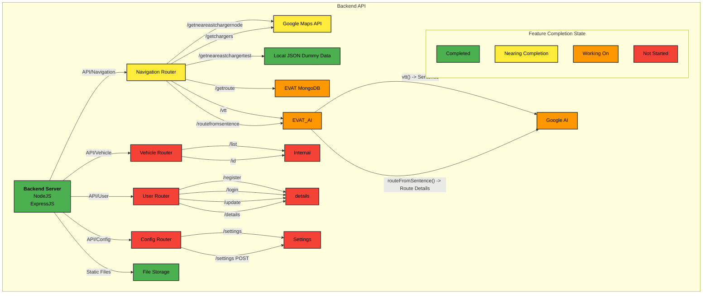

```mermaid
graph LR;
    
    %% Define Colors
    classDef completed fill:#4CAF50,stroke:#333,stroke-width:2px;
    classDef nearing_completion fill:#FFEB3B,stroke:#333,stroke-width:2px;
    classDef working_on fill:#FF9800,stroke:#333,stroke-width:2px;
    classDef not_started fill:#F44336,stroke:#333,stroke-width:2px;

    %% Backend API Main Node
    A[Backend Server\nNodeJS ExpressJS]:::completed

    %% Navigation Router
    B[Navigation Router]:::nearing_completion
    B1[/getneareastchargernode/]:::completed
    B2[/getneareastchargertest/]:::completed
    B3[/getchargers/]:::nearing_completion
    B4[/getroute/]:::working_on
    B5[/vtt/]:::working_on
    B6[/routefromsentence/]:::working_on

    %% Vehicle Router
    C[Vehicle Router]:::not_started
    C1[/list/]:::not_started
    C2[/id/]:::not_started

    %% User Router
    D[User Router]:::not_started
    D1[/register/]:::not_started
    D2[/login/]:::not_started
    D3[/update/]:::not_started
    D4[/details/]:::not_started

    %% Vehicle Settings
    E[Vehicle Router]:::not_started
    E1[/settings/]:::not_started
    E2[/settings POST/]:::not_started

    %% File Storage
    F[File Storage]:::completed
    F1[/React Static Files/]:::completed

    %% External Services
    G[Google Maps API]:::nearing_completion
    H[Local JSON Dummy Data]:::completed
    I[EVAT MongoDB]:::working_on
    J[Google AI]:::working_on

    %% AI Processing
    K[Python Wrapper]:::completed
    L[EVAT_AI]:::working_on

    %% Connections
    A --> B & C & D & E & F

    %% Navigation Router Connections
    B --> B1 & B2 & B3 & B4 & B5 & B6
    B1 & B3 --> G
    B2 --> H
    B4 --> I
    B5 & B6 --> L

    %% Vehicle Router Connections
    C --> C1 & C2

    %% User Router Connections
    D --> D1 & D2 & D3 & D4

    %% Vehicle Settings
    E --> E1 & E2

    %% File Storage
    F --> F1

    %% AI Connections
    L -->|"vtt() -> Sentence"| J
    L -->|"routeFromSentence() -> Route Details"| J

    %% Feature Completion State Legend
    subgraph "Feature Completion State"
        direction TB
        O[Completed]:::completed
        P[Nearing Completion]:::nearing_completion
        Q[Working On]:::working_on
        R[Not Started]:::not_started
    end
